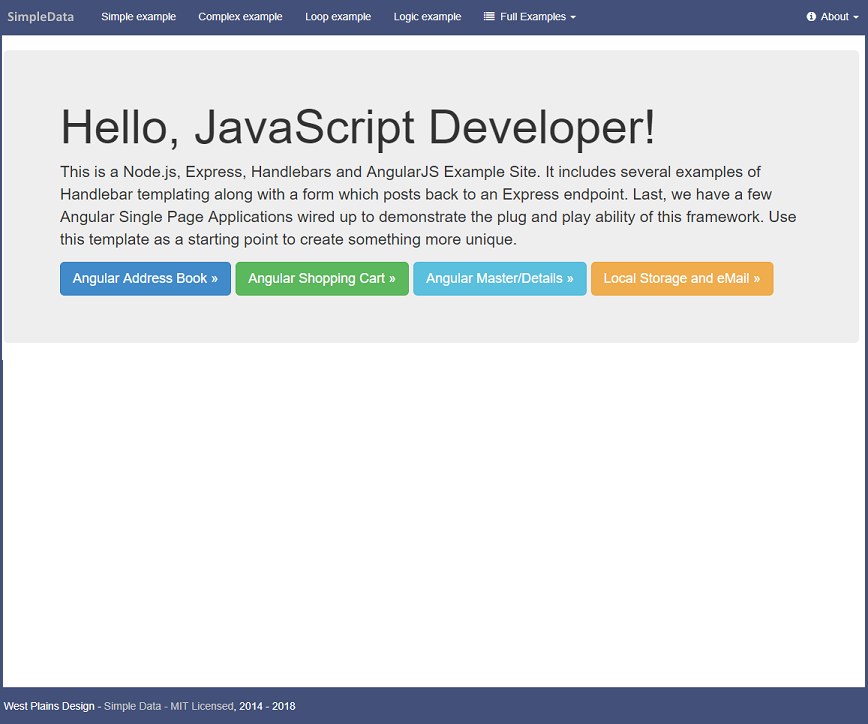
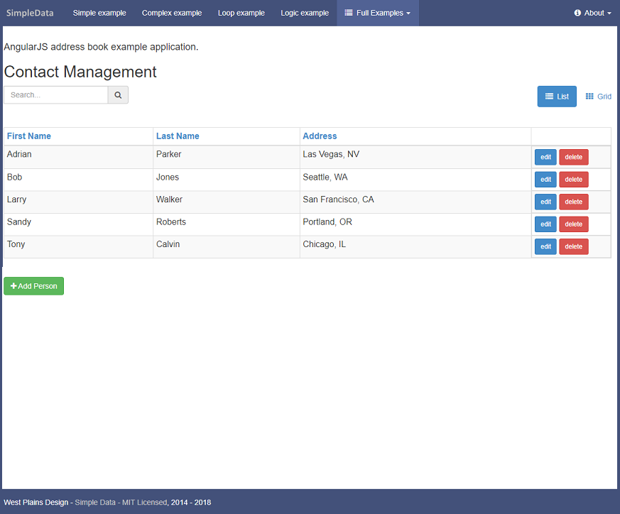

Handlebars Angular
==================

SPA sample application.

When the application is first downloaded, you should run 'npm update' to grab all of the necessary
npm packages.

To start the application up, from a terminal window, type 'npm start'.
